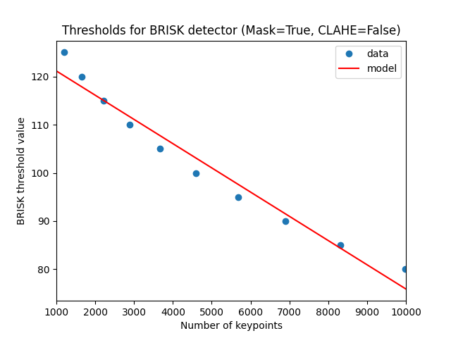
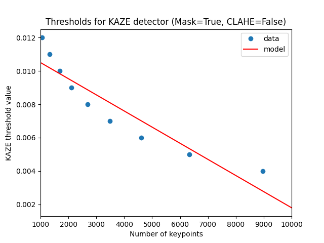
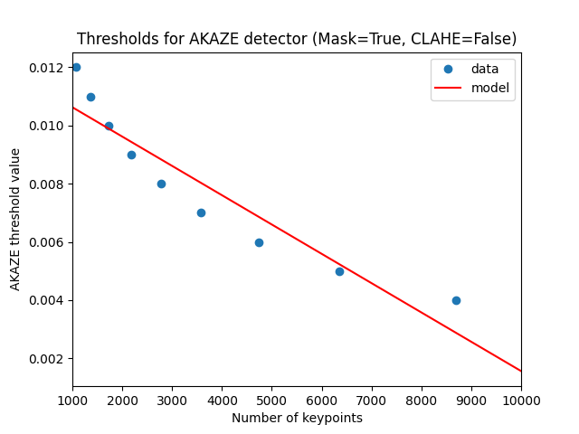

# find_thresholds.py

## Description

The `find_thresholds.py` script generates linear regression models for the BRISK, KAZE, and AKAZE feature detectors. These models quantify the relationship between the threshold values applied by the detectors and the average number of detected keypoints per image. Using a diverse dataset, the script can incorporate axis-aligned bounding boxes to exclude specific regions from detection. It also supports histogram normalization via CLAHE, producing separate models for all combinations of mask and CLAHE usage. These threshold models are essential for establishing a consistent benchmarking framework for the Stabilo library, allowing for fair comparisons with other detectors like ORB, SIFT, and RSIFT based on keypoint count for image matching. An example benchmarking campaign is available in the [stabilo-optimize](https://github.com/rfonod/stabilo-optimize) repository.

> **Note**: The script is designed to work with a diverse image dataset and can be adapted to suit specific requirements and detector configurations.


## Usage

```
python find_thresholds.py <dir> [options]
```

**Arguments:**
- `<dir>`: Directory containing the diverse image dataset.

**Options:**
- `-d DETECTORS`, `--detectors DETECTORS`: List of detectors to analyze. Choices include 'brisk', 'kaze', 'akaze'. (default: ['brisk', 'kaze', 'akaze'])
- `-m MASK_USE`, `--mask-use MASK_USE`: Specify whether to use a mask during detection. Choices: True, False. (default: [True, False])
- `-c CLAHE_USE`, `--clahe-use CLAHE_USE`: Specify whether to apply CLAHE on images. Choices: True, False. (default: [True, False])
- `-msi MASK_START_IDX`, `--mask-start-idx MASK_START_IDX`: Start column index for bounding boxes in the mask file. (default: 2)

> 💡 **Note**: To run this script, install the optional dependencies using `pip install .[extras]` (or `pip install '.[extras]'` if you use zsh).


## Dataset Requirements

1. **Diverse Set of Images**: The dataset should include a diverse set of images representing various scenarios.
2. **Axis-Aligned Bounding Boxes (Optional)**: The images may come with axis-aligned bounding boxes representing regions where features should not be detected.

## Script Functionality
- **Threshold Models**: Finds linear models for BRISK, KAZE, and AKAZE detectors, considering various combinations of detectors, mask usage, and CLAHE.
- **Data Generation**: Collects data by finding the average number of detected keypoints for different threshold values.
- **Model Fitting**: Fits linear models to the collected data, considering a specified range of keypoints.
- **Data Filtering**: Filters the collected data to fit the model only within a specified range of keypoints.
- **Data and Model Storage**: Saves raw and filtered data, as well as the linear models for further analysis.
- **Plotting**: Generates and saves plots illustrating the relationship between average keypoints and thresholds.

## Important Notes
- The dataset should be carefully crafted to ensure a representative set of images with diverse content and scenarios.
- Axis-aligned bounding boxes can be provided to guide the feature detection process and create more meaningful threshold models.
- The generated models will be stored in the `models` directory, while the data and plots will be saved in the `results` and `plots` directories, respectively.

Feel free to adapt the script and instructions based on your specific dataset and requirements.

## Example Output
Below are some example figures generated by the script, illustrating the relationship between average keypoints and thresholds for different detectors.

#### BRISK Detector


#### KAZE Detector


#### AKAZE Detector

